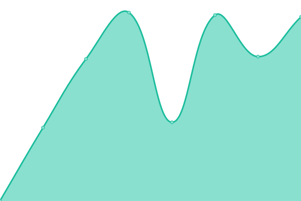

# [📈 Live Status](https://wexlerai.github.io/wexler-status-page): <!--live status--> **🟩 All systems operational**

This repository contains the open-source uptime monitor and status page for [wexlerai](https://wexlerai.github.io/wexler-status-page), powered by [Upptime](https://github.com/upptime/upptime).

With [Upptime](https://upptime.js.org), you can get your own unlimited and free uptime monitor and status page, powered entirely by a GitHub repository. We use [Issues](https://github.com/wexlerai/wexler-status-page/issues) as incident reports, [Actions](https://github.com/wexlerai/wexler-status-page/actions) as uptime monitors, and [Pages](https://wexlerai.github.io/wexler-status-page) for the status page.

<!--start: status pages-->
<!-- This summary is generated by Upptime (https://github.com/upptime/upptime) -->
<!-- Do not edit this manually, your changes will be overwritten -->
<!-- prettier-ignore -->
| URL | Status | History | Response Time | Uptime |
| --- | ------ | ------- | ------------- | ------ |
|  [Landing Page](https://www.wexler.ai) | 🟩 Up | [landing-page.yml](https://github.com/wexlerai/wexler-status-page/commits/HEAD/history/landing-page.yml) | 

 921ms
     
 | 

<a href="https://wexlerai.github.io/wexler-status-page/history/landing-page">100.00%</a>
    

|  [Blog](https://www.wexler.ai/insights) | 🟩 Up | [blog.yml](https://github.com/wexlerai/wexler-status-page/commits/HEAD/history/blog.yml) | 

 397ms
     
 | 

<a href="https://wexlerai.github.io/wexler-status-page/history/blog">100.00%</a>
    

|  [Application](https://app.wexler.ai/) | 🟩 Up | [application.yml](https://github.com/wexlerai/wexler-status-page/commits/HEAD/history/application.yml) | 

 722ms
     
 | 

<a href="https://wexlerai.github.io/wexler-status-page/history/application">100.00%</a>
    

|  [Authentication](https://auth.app.wexler.ai/en/login) | 🟩 Up | [authentication.yml](https://github.com/wexlerai/wexler-status-page/commits/HEAD/history/authentication.yml) | 

 717ms
     
 | 

<a href="https://wexlerai.github.io/wexler-status-page/history/authentication">100.00%</a>
    

|  [API](https://ctty2sm3ct.eu-west-2.awsapprunner.com) | 🟩 Up | [api.yml](https://github.com/wexlerai/wexler-status-page/commits/HEAD/history/api.yml) | 

 455ms
     
 | 

<a href="https://wexlerai.github.io/wexler-status-page/history/api">100.00%</a>
    

|  [Landing Page (DEV)](https://dev.wexler.ai) | 🟩 Up | [landing-page-dev.yml](https://github.com/wexlerai/wexler-status-page/commits/HEAD/history/landing-page-dev.yml) | 

 526ms
     
 | 

<a href="https://wexlerai.github.io/wexler-status-page/history/landing-page-dev">100.00%</a>
    

|  [Blog (DEV)](https://dev.wexler.ai/insights) | 🟩 Up | [blog-dev.yml](https://github.com/wexlerai/wexler-status-page/commits/HEAD/history/blog-dev.yml) | 

 389ms
     
 | 

<a href="https://wexlerai.github.io/wexler-status-page/history/blog-dev">100.00%</a>
    

|  [Application (DEV)](https://dev.app.wexler.ai/) | 🟩 Up | [application-dev.yml](https://github.com/wexlerai/wexler-status-page/commits/HEAD/history/application-dev.yml) | 

 545ms
     
 | 

<a href="https://wexlerai.github.io/wexler-status-page/history/application-dev">100.00%</a>
    

|  [Authentication (DEV)](https://auth.dev.app.wexler.ai/en/login) | 🟩 Up | [authentication-dev.yml](https://github.com/wexlerai/wexler-status-page/commits/HEAD/history/authentication-dev.yml) | 

 654ms
     
 | 

<a href="https://wexlerai.github.io/wexler-status-page/history/authentication-dev">100.00%</a>
    

|  [API (DEV)](https://tc2rqni3gd.eu-west-2.awsapprunner.com) | 🟩 Up | [api-dev.yml](https://github.com/wexlerai/wexler-status-page/commits/HEAD/history/api-dev.yml) | 

 437ms
     
 | 

<a href="https://wexlerai.github.io/wexler-status-page/history/api-dev">100.00%</a>
    

<!--end: status pages-->

[**Visit our status website →**](https://wexlerai.github.io/wexler-status-page)

## 📄 License

- Powered by: [Upptime](https://github.com/upptime/upptime)
- Code: [MIT](./LICENSE) © [Anand Chowdhary](https://anandchowdhary.com), supported by [Pabio](https://pabio.com)
- Data in the `./history` directory: [Open Database License](https://opendatacommons.org/licenses/odbl/1-0/)
